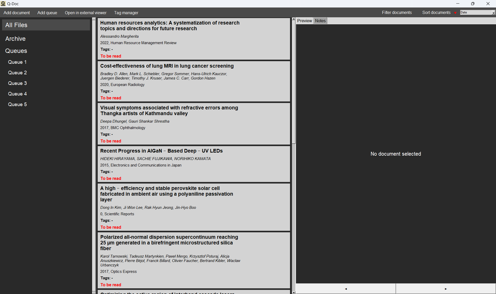
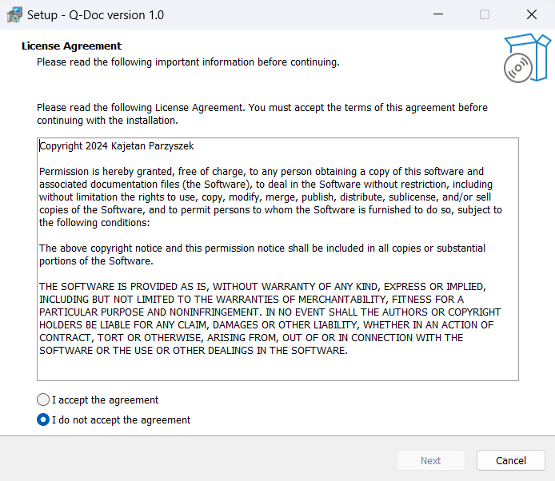

# Q-Doc - document management tool

## Overview

The goal of the project was to design and develop a software tool for document organisation in scientific research. The application is a virtual space for grouping, sorting, reading and queuing articles with a DOI code. It was implemented only for Windows so far with the following tech stack: Python, Tkinter, SQLite, Pyinstaller, Inno Setup. The development process was a part of the author's master's thesis project.

## Possible developments

- Exporting the software for other operating systems
- Adding drag-and-drop interactions for changing the queues order and for adding the files to the queues
- Making the application compatible with other types of documents, not only scientific publications
- Code optimization
- Improving the GUI design

## Repository files

- **main.py** - the program's source code
- **Q-Doc_Setup.exe** - the application's setup file for Windows
- **inno_script.iss** - the script used to generate the setup file
- **requirements.txt** - a set of dependecies used in the development process
- **hook-tkinterdnd2.py** - an additional file used to enable drag-and-drop interactions in the executable file
- **license.txt** - the license file (MIT)
- **q_logo.ico** - the software's icon
- **setup_icon.ico** - the setup file's icon

## Images

- The application's main view
- 

- Editing a document's metadata

- Adding notes to an article

- The database model

- The first step of the installation process

